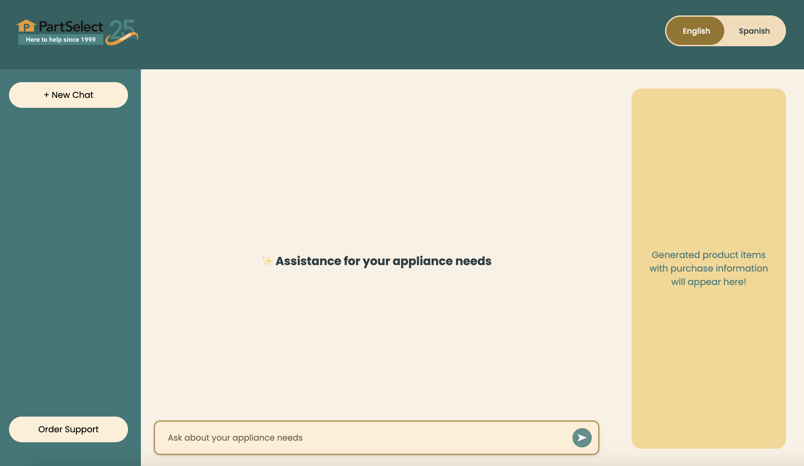
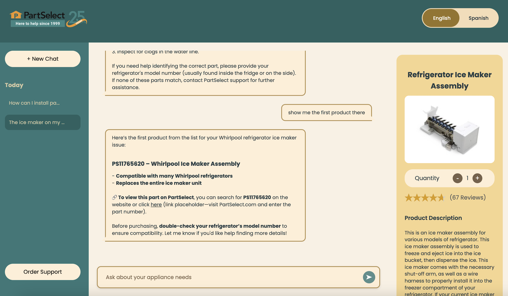

PartSelect Chat Agent: Instalily Case Study

This project is a chat assistant designed for the PartSelect e-commerce website. It focuses on helping users find information about refrigerator and dishwasher parts, along with a few other commonly needed subparts (such as ice makers and pumps). The assistant provides part details, highlights relevant products, and supports multilingual access.

Features:

AI-powered chat focused on refrigerator and dishwasher parts

Web scraping for live product data using scrapeParts.js

Easily extensible by adding more part URLs to the scraper

Persistent chat history across different sessions

English and Spanish language support for increased accessibility

Product cards with scraped details and links to PartSelect

Created using Instalily case-study base code: https://github.com/Instalily/case-study

